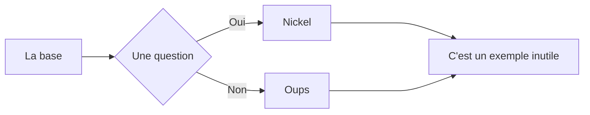

# Markdown_Syntax_FR

Un résumé complet pour écrire en markdown sur github :smiling_face_with_three_hearts:

## Markdown Cheatsheet

## Sommaire :

- [Les titres](#les-titres-)
- [La mise en forme du texte](#la-mise-en-forme-du-texte-)
- [Les liens](#les-liens-)
- [Les tableaux](#les-tableaux-)
- [Le code (`ça`)](#le-code-ça-)
- [Les diagrammes](#les-diagrammes-)
- [Les expressions mathématiques](#les-expressions-mathématiques-)
- [Les listes](#les-listes-)
- [Les séparateurs](#les-séparateurs-)
- [Les images](#les-images-)
- [Comment sauter une ligne](#comment-sauter-une-ligne-)
- [Les touches du clavier](#les-touches-du-clavier-)
- [Les emojis](#les-emojis-)
- [Vidéos YouTube](#vidéos-youtube-)
- [Sources](#sources-)

---

### Les titres :


# Titre 1

    # Titre 1
    OU
    === (en dessous du Titre 1)

## Titre 2

    ## Titre 2
    OU
    --- (en dessous du Titre 2)

### Titre 3

    ### Titre 3

#### Titre 4

    #### Titre 4

##### Titre 5

    ##### Titre 5

###### Titre 6

    ###### Titre 6

---

### La mise en forme du texte :

Texte

    Juste tu écris

_Italique_

    _Ita_ *lique*

~~Barré~~

    ~~Barré~~

__Gras__

    __Gras__ **pas gros**

___Gras + italique___

    ___pour les forceurs___ ***ou si c'est très important***

<u>Souligné</u>

    <u>On est obligés d'utiliser une balise HTML</u>

Les <sup>exposants</sup> et les <sub>indices</sub> :

    Les <sup>exposants</sup> et les <sub>indices</sub>

- [ ] Tâche non complétée
    - [ ] Une sous-tâche
- [x] Tâche finie

```markdown
- [ ] Tâche non complétée
    - [ ] Une sous-tâche
- [x] Tâche finie
```

Blocs de citation :

> Citation
>> Sous-citation
>>> Sous-sous-...

    > Citation
    >> Sous-citation
    >>> Utile pour recréer des réponses

Les alertes :

> [!NOTE]  
> Une information utile que les utilisateurs devraient connaître, même en survolant le contenu.

> [!TIP]  
> Un conseil utile pour mieux faire les choses ou plus facilement.

> [!IMPORTANT]  
> Une information clé que les utilisateurs doivent connaître pour atteindre leur objectif.

> [!WARNING]  
> Une information urgente qui nécessite l'attention immédiate de l'utilisateur pour éviter les problèmes.

> [!CAUTION]  
> Informe sur les risques ou les résultats négatifs de certaines actions.

```markdown
> [!NOTE]  
> Une information utile que les utilisateurs devraient connaître, même en survolant le contenu.

> [!TIP]  
> Un conseil utile pour mieux faire les choses ou plus facilement.

> [!IMPORTANT]  
> Une information clé que les utilisateurs doivent connaître pour atteindre leur objectif.

> [!WARNING]  
> Une information urgente qui nécessite l'attention immédiate de l'utilisateur pour éviter les problèmes.

> [!CAUTION]  
> Informe sur les risques ou les résultats négatifs de certaines actions.
```

Texte (ou n'importe quoi) dépliable :

<details>
  <summary>Titre 1</summary>
    <p>Ce genre de truc est utile pour faire des menus avec dedans des trucs pas très importants</p>
</details>
<details>
  <summary>Spoiler Alert</summary>
    <p>Ils meurent tous à la fin (ouais, y'a pas de truc "spoiler" comme sur Discord ou Telegram, ce truc peut donc être utile pour ça)</p>
</details>

    <details>
      <summary>Titre 1</summary>
        <p>Ce genre de truc est utile pour faire des menus avec dedans des trucs pas très importants</p>
    </details>
    <details>
      <summary>Spoiler Alert</summary>
        <p>Ils meurent tous à la fin (ouais, y'a pas de truc "spoiler" comme sur Discord ou Telegram, ce truc peut donc être utile pour ça)</p>
    </details>

Les codes couleurs :  
`#FFB86C` orange, `rgb(241, 250, 140)` jaune et `hsl(265, 89%, 78%)` violet (ne fonctionne que dans les issues, pull requests et discussions, voir [ici](https://github.com/EDM115/Markdown_Syntax_FR/issues/1#issuecomment-2067021822))

    `#FFB86C` orange, `rgb(241, 250, 140)` jaune et `hsl(265, 89%, 78%)` violet

Les notes de bas de page :  
Voir la note de bas de page[^1]

    Voir la note de bas de page[^1]

    [^1]: C'est la note de bas de page

[^1]: C'est la note de bas de page

---

### Les liens :

[Texte avec un lien](https://github.com/EDM115/ "eheh c'est moi 😎") et liens sans texte : https://lien.fr/ ou <https://autrelien.com/> (marche aussi avec les <adresses@mail.com>)

    [Le texte](https://unlienrandom.fr/ "Le texte de l'info-bulle") https://lien.fr/ ou <https://autrelien.com/> (marche aussi avec les <adresses@mail.com>)

Lien vers une partie spécifique du README.md :

[Va en haut](#markdown_syntax_fr)

    [Nom de l'ancre](#id)

---

### Les tableaux :

Un tableau, comme ici :

Colonne 1 | Colonne 2
------------- | -------------
Text | Texte
Texte  | Texte

```markdown
Colonne 1  | Colonne 2
---------- | ---------
Texte      | Texte
Texte      | Texte

(note : les | n'ont pas besoin d'être alignés)
```

Ajouter `|` Dans un tableau :

Colonne 1  | Colonne 2
---------- | ---------
Texte      | Texte
Texte      | \|

```markdown
Ajoute un backslash avant : \|
```

Tableau aligné à gauche, centre, droite

Gauche | Centre | Droite
| :--- | :---: | ---:
◀️  | ⏺️ | ▶️
⬅️  | 🔛 | ➡️

```markdown
Gauche | Centre | Droite
| :--- | :---: | ---:
◀️  | ⏺️ | ▶️
⬅️  | 🔛 | ➡️
```

---

### Le code (`ça`) :

`code()`

    `code()`
    OU
    Tu indentes le code

```javascript
async function getWeather(city) {
    const response = await fetch(`https://api.openweathermap.org/data/2.5/weather?q=${city}&appid=APIKEY`);
    const data = await response.json();
    return data;
}
```

    ```javascript
    ...
    ```

```python
async def execute_command(command):
    process = await asyncio.create_subprocess_shell(command, stdout=asyncio.subprocess.PIPE, stderr=asyncio.subprocess.PIPE)
    stdout, stderr = await process.communicate()
    return stdout, stderr
```

    ```python
    ...
    ```

```html
<h3>HTML</h3>
<p>Un peu de HTML ici (oui, les balises HTML sont compatibles sur GitHub 😃)</p>
```

    ```html
    ...
    ```

---

### Les diagrammes :

Avec mermaid :



Vous pouvez aller voir [la doc](https://mermaid-js.github.io/mermaid/#/) et pourquoi pas expérimenter sur la [demo](https://mermaid.live/edit)

    ```mermaid
    flowchart LR
        A[La base] --> B{Une question};
        B -- Oui --> C[Nickel];
        B -- Non --> D[Oups];
        C ----> E[C'est un exemple inutile];
        D ----> E[C'est un exemple inutile];
    ```

Avec GeoJSON :

```geojson
{
    "type": "FeatureCollection",
    "features": [
        {
            "type": "Feature",
            "id": 1,
            "properties": {
                "ID": 0
            },
            "geometry": {
                "type": "Polygon",
                "coordinates": [
                    [
                        [-90,35],
                        [-90,30],
                        [-85,30],
                        [-85,35],
                        [-90,35]
                    ]
                ]
            }
        }
    ]
}
```

    ```geojson
    {
    "type": "FeatureCollection",
    "features": [
        {
            "type": "Feature",
            "id": 1,
            "properties": {
                "ID": 0
            },
            "geometry": {
                "type": "Polygon",
                "coordinates": [
                    [
                        [-90,35],
                        [-90,30],
                        [-85,30],
                        [-85,35],
                        [-90,35]
                    ]
                ]
            }
        }
    ]
    }
    ```

Avec TopoJSON :

```topojson
{
    "type": "Topology",
    "transform": {
        "scale": [0.0005000500050005, 0.00010001000100010001],
        "translate": [100, 0]
    },
    "objects": {
        "example": {
            "type": "GeometryCollection",
            "geometries": [
                {
                    "type": "Point",
                    "properties": {"prop0": "value0"},
                    "coordinates": [4000, 5000]
                },
                {
                    "type": "LineString",
                    "properties": {"prop0": "value0", "prop1": 0},
                    "arcs": [0]
                },
                {
                    "type": "Polygon",
                    "properties": {"prop0": "value0",
                        "prop1": {"this": "that"}
                    },
                    "arcs": [[1]]
                }
            ]
        }
    },
    "arcs": [[[4000, 0], [1999, 9999], [2000, -9999], [2000, 9999]],[[0, 0], [0, 9999], [2000, 0], [0, -9999], [-2000, 0]]]
}
```

    ```topojson
    {
        "type": "Topology",
        "transform": {
            "scale": [0.0005000500050005, 0.00010001000100010001],
            "translate": [100, 0]
        },
        "objects": {
            "example": {
                "type": "GeometryCollection",
                "geometries": [
                    {
                        "type": "Point",
                        "properties": {"prop0": "value0"},
                        "coordinates": [4000, 5000]
                    },
                    {
                        "type": "LineString",
                        "properties": {"prop0": "value0", "prop1": 0},
                        "arcs": [0]
                    },
                    {
                        "type": "Polygon",
                        "properties": {"prop0": "value0",
                            "prop1": {"this": "that"}
                        },
                        "arcs": [[1]]
                    }
                ]
            }
        },
        "arcs": [[[4000, 0], [1999, 9999], [2000, -9999], [2000, 9999]],[[0, 0], [0, 9999], [2000, 0], [0, -9999], [-2000, 0]]]
    }
    ```

Avec un modèle 3D STL :

```stl
solid cube_corner
    facet normal 0.0 -1.0 0.0
    outer loop
        vertex 0.0 0.0 0.0
        vertex 1.0 0.0 0.0
        vertex 0.0 0.0 1.0
    endloop
    endfacet
    facet normal 0.0 0.0 -1.0
    outer loop
        vertex 0.0 0.0 0.0
        vertex 0.0 1.0 0.0
        vertex 1.0 0.0 0.0
    endloop
    endfacet
    facet normal -1.0 0.0 0.0
    outer loop
        vertex 0.0 0.0 0.0
        vertex 0.0 0.0 1.0
        vertex 0.0 1.0 0.0
    endloop
    endfacet
    facet normal 0.577 0.577 0.577
    outer loop
        vertex 1.0 0.0 0.0
        vertex 0.0 1.0 0.0
        vertex 0.0 0.0 1.0
    endloop
    endfacet
endsolid
```

    ```stl
    solid cube_corner
        facet normal 0.0 -1.0 0.0
        outer loop
            vertex 0.0 0.0 0.0
            vertex 1.0 0.0 0.0
            vertex 0.0 0.0 1.0
        endloop
        endfacet
        facet normal 0.0 0.0 -1.0
        outer loop
            vertex 0.0 0.0 0.0
            vertex 0.0 1.0 0.0
            vertex 1.0 0.0 0.0
        endloop
        endfacet
        facet normal -1.0 0.0 0.0
        outer loop
            vertex 0.0 0.0 0.0
            vertex 0.0 0.0 1.0
            vertex 0.0 1.0 0.0
        endloop
        endfacet
        facet normal 0.577 0.577 0.577
        outer loop
            vertex 1.0 0.0 0.0
            vertex 0.0 1.0 0.0
            vertex 0.0 0.0 1.0
        endloop
        endfacet
    endsolid
    ```

---

### Les expressions mathématiques :

$$\left( \sum_{k=1}^n a_k b_k \right)^2 \leq \left( \sum_{k=1}^n a_k^2 \right) \left( \sum_{k=1}^n b_k^2 \right)$$  
Il s'agit des expressions LaTeX, GitHub a intégré [MathJax](http://docs.mathjax.org/en/latest/input/tex/index.html#tex-and-latex-support) directement dans GitHub Flavored Markdown

Pour utiliser une expression dans une ligne, on l'entoure avec `$` :  
Un exemple $\sqrt{3x-1}+(1+x)^2$ dans une ligne

    Un exemple $\sqrt{3x-1}+(1+x)^2$ dans une ligne

Pour le mettre dans un bloc distinct, soit on l'entoure avec `$$`, soit un crée un code block avec le mot-clé math :

    $$\left( \sum_{k=1}^n a_k b_k \right)^2 \leq \left( \sum_{k=1}^n a_k^2 \right) \left( \sum_{k=1}^n b_k^2 \right)$$

OU

    ```math
    \left( \sum_{k=1}^n a_k b_k \right)^2 \leq \left( \sum_{k=1}^n a_k^2 \right) \left( \sum_{k=1}^n b_k^2 \right)
    ```

Plus d'info pour ce que vous pouvez utiliser [ici](http://docs.mathjax.org/en/latest/input/tex/extensions/index.html)/[ou ici](http://docs.mathjax.org/en/latest/input/tex/macros/index.html), et des infos générales [là](https://en.wikibooks.org/wiki/LaTeX/Mathematics)

---

### Les listes :

* Liste non ordonnée
    * Un point à côté
        * Encore à côté, …
* Autre liste non ordonnée

```markdown
* Liste non ordonnée
    * Un point à côté
        * Encore à côté, …
* Autre liste non ordonnée

Caractères utilisables : * - +
```

1. Liste numérotée
    1. Indentée
    2. La suite de l'indentation
    3. Les chiffres utilisés n'importent pas
    4. Du moment que c'est des chiffres
2. Suite des numéros

```markdown
1. Liste numérotée
    1. Indentée
    2. La suite de l'indentation
    4. Les chiffres utilisés n'importent pas
    8. Du moment que c'est des chiffres
2. Suite des numéros
```

---

### Les séparateurs :

C'est ce que tu vois entre chaque section

    ---
    OU
    ***

---

### Les images :

_Image avec texte alternatif :_


    

Spécifier une image en fonction du thème (clair/sombre) :
<picture width="100px" height="100px">
  <source media="(prefers-color-scheme: dark)" srcset="https://user-images.githubusercontent.com/25423296/163456776-7f95b81a-f1ed-45f7-b7ab-8fa810d529fa.png">
  <source media="(prefers-color-scheme: light)" srcset="https://user-images.githubusercontent.com/25423296/163456779-a8556205-d0a5-45e2-ac17-42d089e3c3f8.png">
  
</picture>

    <picture width="100px" height="100px">
      <source media="(prefers-color-scheme: dark)" srcset="https://user-images.githubusercontent.com/25423296/163456776-7f95b81a-f1ed-45f7-b7ab-8fa810d529fa.png">
      <source media="(prefers-color-scheme: light)" srcset="https://user-images.githubusercontent.com/25423296/163456779-a8556205-d0a5-45e2-ac17-42d089e3c3f8.png">
      
    </picture>

---

### Comment sauter une ligne :

C'est pas aussi simple que vous le pensez...
Là par exemple, j'ai fait un ↩ mais... Ça n'apparaît pas !  
La solution, y'en a plusieurs en fait :  

    Utiliser un tag <br>
    Utiliser DEUX espaces à la fin d'une ligne ⎵ ⎵
    Sauter DEUX lignes ↩ ↩

---

### Les touches du clavier :

<kbd>⌘</kbd> + <kbd>F</kbd>

    <kbd>⌘</kbd> + <kbd>F</kbd>

*Petite liste de symboles :*

| Touche | Symbole |
| --- | --- |
| Option | ⌥ |
| Contrôle | ⌃ |
| Command (ou win) | ⌘ / ⊞ Win |
| Maj | ⇧ |
| Verr. Maj | ⇪ |
| Tab | ⇥ / ↹ |
| Echap | ⎋ |
| Marche-arrêt | ⌽ / ⏻ |
| Entrée | ↩ / ↵ |
| Suppr | ⌫ |
| Haut | ↑ |
| Bas | ↓ |
| Gauche | ← |
| Droite | → |

---

### Les emojis :

:exclamation: Utilise les emojis pour rendre un texte plus compréhensible :+1:  La liste est la même que pour Discord et Telegram : [ikatyang/emoji-cheat-sheet](https://github.com/ikatyang/emoji-cheat-sheet/), avec quelques bonus : :accessibility:, :atom:, :dependabot:, :electron:, :octocat:, :trollface:, ...

    EXACTEMENT pareil que Discord et Telegram, c'est entre : :EMOJICODE:

---

### Vidéos YouTube :

Y'a pas de support direct, **en revanche** tu peux mettre une image avec un lien vers la vidéo :  
[](https://www.youtube.com/watch?v=h2csePLbahQ)

    [](http://www.youtube.com/watch?v=ID)

Si tu veux une taille spécifique, tu passe en html :  
<a href  ="https://www.youtube.com/watch?feature=player_embedded&v=h2csePLbahQ" target="_blank"></a>

    <a href  ="https://www.youtube.com/watch?feature=player_embedded&v=ID" target="_blank"></a>

---

#### Sources :

- [tchapi/markdown-cheatsheet](https://github.com/tchapi/markdown-cheatsheet)
- [adam-p/markdown-here](https://github.com/adam-p/markdown-here/wiki/Markdown-Here-Cheatsheet)
- [GitHub Documentation](https://docs.github.com/en/github/writing-on-github/getting-started-with-writing-and-formatting-on-github/basic-writing-and-formatting-syntax)
