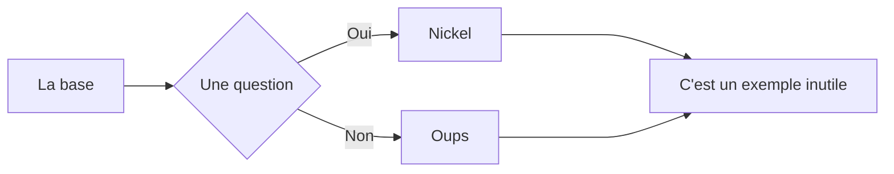

# Markdown_Syntax_FR
Juste de l'aide pour écrire en markdown sur github 😃

## Markdown Cheatsheet<a name="top"></a>

## Sommaire :

- <a href="#titres">Les titres</a>  
- <a href="#word">La mise en forme du texte (comme dans Word)</a>  
- <a href="#liens">Les liens</a>  
- <a href="#tableaux">Les tableaux</a>  
- <a href="#code">Le code (`ça`)</a>  
- <a href="#diagramme">Les diagrammes</a>  
- <a href="#math">Les expressions mathématiques</a>  
- <a href="#listes">Les listes</a>  
- <a href="#separation">Les séparateurs</a>  
- <a href="#images">Les images</a>  
- <a href="#saut">Comment sauter une ligne</a>  
- <a href="clavier">Les touches du clavier</a>  
- <a href="#emoji">Les emojis</a>  
- <a href="#yt">Vidéos YouTube</a>  
- <a href="#credits">Crédits</a>  

---

<a name="titres"><h3>Les titres :</h3></a>


# Titre 1 #

    # Titre 1 #

    ou

    ============= (en dessous du Titre 1)


## Titre 2 ##

    ## Titre 2 ##

    ou

    --------------- (en dessous du Titre 2)


### Titre 3 ###

    ### Titre 3 ###


#### Titre 4 ####

    #### Titre 4 ####


##### Titre 5 #####

    ##### Titre 5 #####


###### Titre 6 ######

    ###### Titre 6 ######

---

<a name="word"><h3>La mise en forme du texte (comme dans Word) :</h3></a>

Texte

    Juste tu écris


_Italique_

    _Ita_ *lique*


~~Barré~~ (problèmes d'affichage sur certains navigateurs ou OS pas à jour)

    ~~Barré~~


__Gras__

    __Gras__ **pas gros**


___Gras + italique___

    ___pour les forceurs___ ***ou si c'est très important***


<u>Souligné</u>

    <u>On est obligés d'utiliser une balise HTML</u>


- [ ] Tâche non complétée
    - [ ] Une sous-tâche
- [x] Tâche finie

~~~
- [ ] Tâche non complétée
    - [ ] Une sous-tâche
- [x] Tâche finie
~~~


Blocs de citation :

> Citation
>> Sous-citation
>>> Sous-sous-...

    > Citation
    >> Sous-citation
    >>> Utile pour recréer des réponses

Texte (ou n'importe quoi) dépliable :

<details>
  <summary>Titre 1</summary>
    <p>Ce genre de truc est utile pour faire des menus avec dedans des trucs pas très importants</p>
</details>
<details>
  <summary>Spoiler Alert</summary>
    <p>Ils meurent tous à la fin (ouais, y'a pas de truc "spoiler" comme sur Discord ou Telegram, ce truc peut donc être utile pour ça)</p>
</details>

    <details>
      <summary>Titre 1</summary>
        <p>Ce genre de truc est utile pour faire des menus avec dedans des trucs pas très importants</p>
    </details>
    <details>
      <summary>Spoiler Alert</summary>
        <p>Ils meurent tous à la fin (ouais, y'a pas de truc "spoiler" comme sur Discord ou Telegram, ce truc peut donc être utile pour ça)</p>
    </details>

---

<a name="liens"><h3>Les liens :</h3></a>

[Texte avec un lien](https://github.com/EDM115/ "eheh c'est moi 😎") et liens sans texte : https://lien.fr/ ou <https://autrelien.com/> (marche aussi avec les <adresses@mail.com>)

    [Le texte](https://unlienrandom.fr/ "Le texte de l'info-bulle") https://lien.fr/ ou <https://autrelien.com/> (marche aussi avec les <adresses@mail.com>)


[Aller dans une autre catégorie](#texte "Bah vas-y 🤓")
    
    [nom du lien](#nom de l'ancre "info-bulle") ET <a name="nom de l'ancre"></a> à coté (ou devant) ton texte


Lien vers une partie spécifique du README.md :

[Va en haut](#top)
   
    [Nom de l'ancre](#id)
    ET
    À côté de la destination de ton ancre : <a name="id"></a>

---

<a name="tableaux"><h3>Les tableaux :</h3></a>

Un tableau, comme ici :

Colonne 1 | Colonne 2
------------- | -------------
Text | Texte
Texte  | Texte

```
Colonne 1  | Colonne 2
---------- | ---------
Texte      | Texte
Texte      | Texte
(note : les | n'ont pas besoin d'être alignées)
```

Ajouter `|` Dans un tableau :

Colonne 1  | Colonne 2
---------- | ---------
Texte      | Texte
Texte      | \|

```
Ajoute un antislash avant : \| 
```

Tableau aligné à gauche, centre, droite

Gauche | Centre | Droite
| :--- | :---: | ---:
◀️  | ⏺️ | ▶️
⬅️  | 🔛 | ➡️

```
Gauche | Centre | Droite
| :--- | :---: | ---:
◀️  | ⏺️ | ▶️
⬅️  | 🔛 | ➡️
```

---

<a name="code"><h3>Le code (`ça`) :</h3></a>

`code()`

    `code()`
    
    OU
    
    <code>code()</code>
    
    OU
    
    Tu l'entoure avec des retours à la ligne et tabulations/4 espaces :
    ↵
    ↹code()
    ↵
    
    OU
    
    ~~~
    code
    ~~~


```javascript
    var specificLanguage_code = 
    {
        "data": {
            "lookedUpPlatform": 1,
            "query": "404+DJ+teke+me+home",
            "lookedUpItem": {
                "name": "Take me home",
                "artist": "404__DJ",
                "album": "Take me home",
                "picture": "https://i.scdn.co/image/ab67616d00001e02ebcc01a9709ceb39f0dbc68b",
                "link": "https://open.spotify.com/track/3b935Jhv7ZnWZQqWin2DJy?si=c2e942ea62d94838"
            }
        }
    }
```

    ```javascript
    ```


```python
    while True:
        print("I love coffee")
```

    ```python
    ```


```html
<h3>HTML</h3>
<p>Un peu de HTML ici (oui, les balises HTML sont compatibles sur GitHub 😃)</p>
```

    ```html
    <h3>HTML</h3>
    <p>Un peu de HTML ici (oui, les balises HTML sont compatibles sur GitHub 😃)</p>
    ```

---

<a name="diagrammme"><h3>Les diagrammes :</h3></a>


Ça utilise [mermaid](https://github.com/mermaid-js/mermaid#readme) et c'est assez compliqué à expliquer 😭  
Le mieux, c'est que vous alliez voir [la doc](https://mermaid-js.github.io/mermaid/#/) et pourquoi pas expérimenter sur la [demo](https://mermaid.live/edit)  

    ```mermaid
    flowchart LR
        A[La base] --> B{Une question};
        B -- Oui --> C[Nickel];
        B -- Non --> D[Oups];
        C ----> E[C'est un exemple inutile];
        D ----> E[C'est un exemple inutile];
    ```

---

<a name="math"><h3>Les expressions mathématiques :</h3></a>

$$\left( \sum_{k=1}^n a_k b_k \right)^2 \leq \left( \sum_{k=1}^n a_k^2 \right) \left( \sum_{k=1}^n b_k^2 \right)$$  
Il s'agit des expressions LaTeX, GitHub a intégré [MathJax](http://docs.mathjax.org/en/latest/input/tex/index.html#tex-and-latex-support) direcement dans GitHub Flavored Markdown  
  
Pour utiliser une expression dans une ligne, on l'entoure avec `$` :  
Un exemple $\sqrt{3x-1}+(1+x)^2$ dans une ligne

    Un exemple $\sqrt{3x-1}+(1+x)^2$ dans une ligne

Pour le mettre dans un bloc distinct, soit on l'entoure avec `$$`, soit un crée un code block avec le mot-clé math :

    $$\left( \sum_{k=1}^n a_k b_k \right)^2 \leq \left( \sum_{k=1}^n a_k^2 \right) \left( \sum_{k=1}^n b_k^2 \right)$$  
    
OU
    
    ```math
    \left( \sum_{k=1}^n a_k b_k \right)^2 \leq \left( \sum_{k=1}^n a_k^2 \right) \left( \sum_{k=1}^n b_k^2 \right)
    ```

Plus d'info pour ce que vous pouvez utiliser [ici](http://docs.mathjax.org/en/latest/input/tex/extensions/index.html)/[ou ici](http://docs.mathjax.org/en/latest/input/tex/macros/index.html), et des infos générales [là](https://en.wikibooks.org/wiki/LaTeX/Mathematics)

---

<a name="listes"><h3>Les listes :</h3></a>

* Liste non ordonnée
    * Un point à côté
        * Encore à côté, …
* Autre liste non ordonnée

~~~
* Liste non ordonnée
    * Un point à côté
        * Encore à côté, …
* Autre liste non ordonnée

Caractères utilisables : * - +
~~~

1. Liste numérotée
    1. Indentée
    2. La suite de l'indentation
    4. Les chiffres utilisés n'importent pas
    8. Du moment que c'est des chiffres
2. Suite des numéros

~~~
1. Liste numérotée
    1. Indentée
    2. La suite de l'indentation
    4. Les chiffres utilisés n'importent pas
    8. Du moment que c'est des chiffres
2. Suite des numéros
~~~

---

<a name="separation"><h3>Les séparateurs :</h3></a>

_Ligne horizontale :_
---

    - - - -
    
    OU
    
    ---

---

<a name="images"><h3>Les images :</h3></a>

_Image avec texte alternatif :_


    

---

<a name="saut"><h3>Comment sauter une ligne :</h3></a>

C'est pas aussi simple que vous le pensez...
Là par exemple, j'ai fait un ↩ mais... Ça n'apparaît pas !  
La solution, y'en a plusieurs en fait :  

    Utiliser un tag <br>
    Utiliser DEUX espaces à la fin d'une ligne ⎵ ⎵
    Sauter DEUX lignes ↩ ↩ 

---

<a name="clavier"><h3>Les touches du clavier :</h3></a>

Touche du clavier :

<kbd>⌘F</kbd>

<kbd>⇧⌘F</kbd>

    <kbd>⌘F</kbd>

*Liste des touches compatibles :*

| Touche | Symbole |
| --- | --- |
| Option | ⌥ |
| Contrôle | ⌃ |
| Command (ou win) | ⌘ / ⊞ Win |
| Maj | ⇧ |
| Verr. Maj | ⇪ |
| Tab | ⇥ / ↹ |
| Echap | ⎋ |
| Marche-arrêt | ⌽ / ⏻ |
| Entrée | ↩ / ↵ |
| Suppr | ⌫ |
| Haut | ↑ |
| Bas | ↓ |
| Gauche | ← |
| Droite | → |

---

<a name="emoji"><h3>Les emojis :</h3></a>

Emoji :

:exclamation: Utilise les emojis pour rendre un texte plus compréhensible :+1:  La liste est la même que pour Discord et Telegram [emoji-cheat-sheet.com](http://emoji-cheat-sheet.com/)

    EXACTEMENT pareil que Discord et Telegram, c'est entre : :EMOJICODE:

---

<a name="yt"><h3>Vidéos YouTube :</h3></a>

Vidéos YouTube :  
Y'a pas de support direct, **en revanche** tu peux mettre une image avec un lien vers la vidéo :  
[](https://www.youtube.com/watch?v=h2csePLbahQ)

    [](http://www.youtube.com/watch?v=l'ID de la vidéo)

Si tu veux une taille spécifique, tu passe en html :  
<a href  ="https://www.youtube.com/watch?feature=player_embedded&v=h2csePLbahQ" target="_blank"></a>

    <a href  ="https://www.youtube.com/watch?feature=player_embedded&v=h2csePLbahQ" target="_blank"></a>

---

<a name="credits"></a>
#### Sources :
- [x] [tchapi](https://github.com/tchapi/markdown-cheatsheet)
- [x] [adam-p](https://github.com/adam-p/markdown-here/wiki/Markdown-Here-Cheatsheet)
